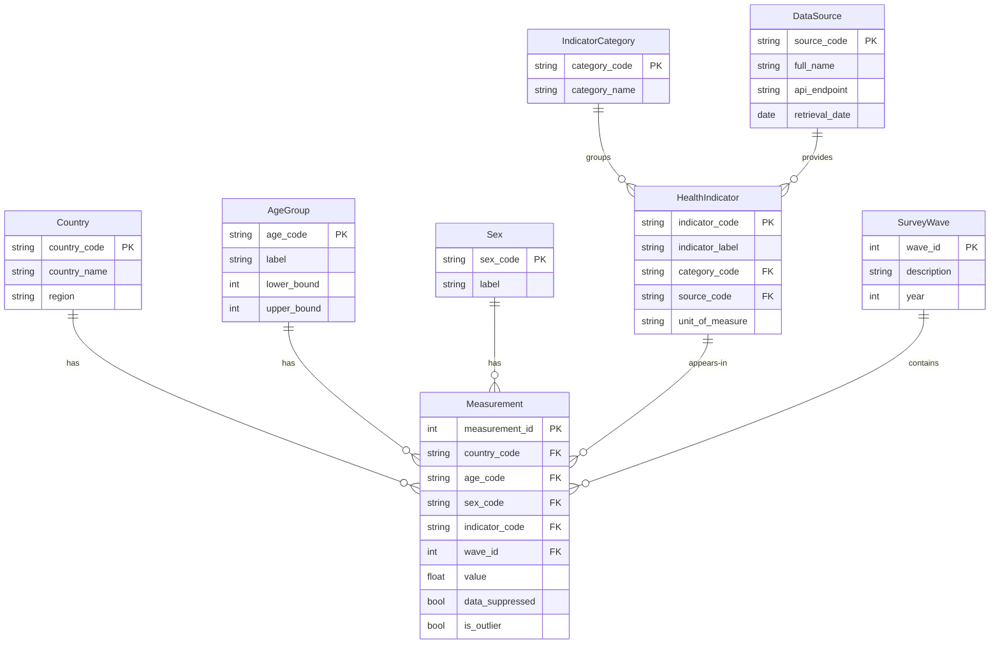

# Conceptual ERD

## Physical Activity and Chronic Disease Burden Across Europe

## Star Schema Description

The data model follows a **star schema** with **Measurement** as the central fact table and seven dimension tables:

| Dimension | Role | Attributes |
|-----------|------|------------|
| Country | Geography | country_code (PK), country_name, region |
| AgeGroup | Demography | age_code (PK), label, lower_bound, upper_bound |
| Sex | Demography | sex_code (PK), label |
| HealthIndicator | Subject matter | indicator_code (PK), indicator_label, unit_of_measure, category_code (FK), source_code (FK) |
| IndicatorCategory | Classification | category_code (PK), category_name |
| SurveyWave | Time | wave_id (PK), description, year |
| DataSource | Provenance | source_code (PK), full_name, api_endpoint |

Two dimensions (IndicatorCategory, DataSource) relate to HealthIndicator rather than directly to Measurement, creating a minor snowflake extension. This is acceptable because these tables change rarely and join depth stays at a maximum of two hops from the fact table.
