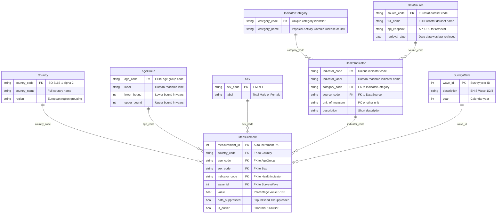

# Logical ERD (3NF)

## Physical Activity and Chronic Disease Burden Across Europe

## Normalisation Notes

### 2NF Violation Resolved

**Before:** `HealthIndicator` had `category_name` stored directly alongside `category_code`. This violated 2NF because `category_name` depended on `category_code`, which is only part of a candidate key.

**After:** `category_name` moved to the `IndicatorCategory` table. `HealthIndicator` references it via `category_code` FK.

### 3NF Violation Resolved

**Before:** `Measurement` had `country_name` stored directly alongside `country_code`. This violated 3NF because `country_name` transitively depends on `country_code` via the `Country` entity.

**After:** `country_name` moved to the `Country` table only. `Measurement` references it via `country_code` FK.
